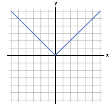
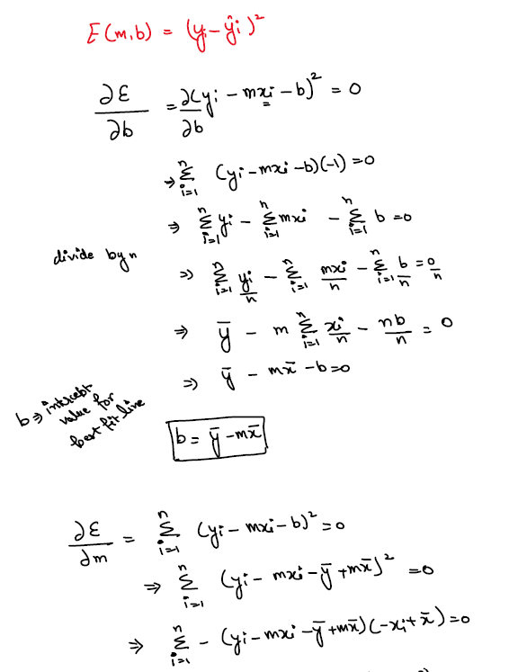
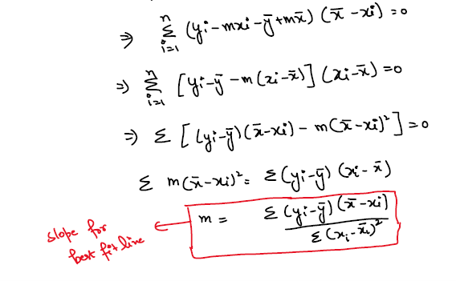
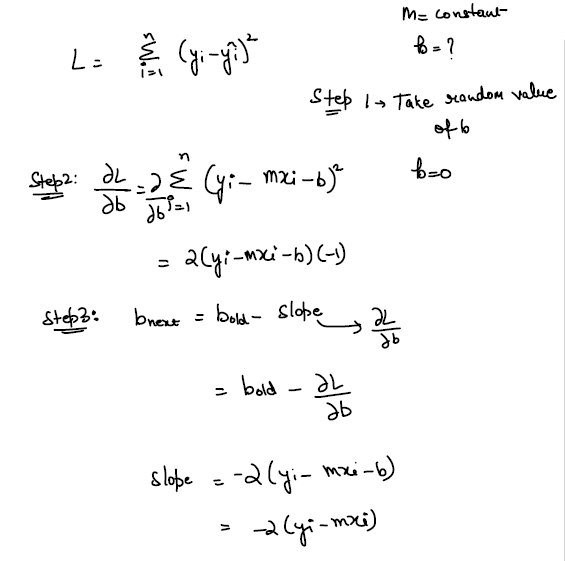
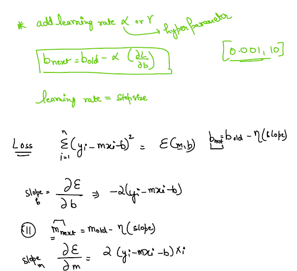

# Linear Regression

Linear regression is a fundamental machine learning algorithm used for predictive modeling and regression tasks. It's a supervised learning algorithm, meaning it learns from labeled training data, where the output (also called the dependent variable) is continuous. The goal of linear regression is to find the best-fitting straight line that represents the relationship between the input features (independent variables) and the target output.

The basic idea behind linear regression is to model the relationship between the input features (denoted as X) and the target output (denoted as y) as a linear function. For a simple linear regression with only one feature, the relationship can be represented as:

y = mx + b

Where:
- y is the target output (the dependent variable we want to predict).
- x is the input feature (the independent variable).
- m is the slope of the line (how much y changes with a unit change in x).
- b is the y-intercept (the value of y when x is 0).

The goal of linear regression is to find the values of m and b that best fit the data, meaning the line that minimizes the error between the predicted values and the actual target values.

In the case of multiple features (multiple linear regression), the linear function becomes:

y = b + m1 * x1 + m2 * x2 + ... + mn * xn

Where:
- x1, x2, ..., xn are the different input features.
- m1, m2, ..., mn are the corresponding slopes for each feature.
- b is the y-intercept.

To find the best-fitting line, linear regression uses a method called the "ordinary least squares" (OLS) approach. This method calculates the sum of squared differences between the actual target values and the predicted values. The coefficients (m and b) are then adjusted iteratively to minimize this sum of squared differences, giving us the best line that fits the data.

Once the model is trained, we can use it to make predictions on new, unseen data by inputting the feature values into the equation, and the model will provide the predicted output.

It's essential to note that linear regression assumes a linear relationship between the input features and the target output. If the relationship is more complex, other regression techniques or more advanced machine learning algorithms may be more appropriate. Additionally, linear regression can be sensitive to outliers in the data, which can affect the model's performance.

## Important Notes
1. Equation of line: 
    $y = mx + b $
2. Errors 
    $E = {y_i - ý} $ 
    $E = {y_i - (mx_i + b)}$
3. Absolute Errors: Cannot use calculus because discontinuty is present at 0 
    $E = {|y_i - ý|} $ 
    
    
4. Squared Errors: 
     
    
5. Mean Absolute Error: 
    $MAE = {1\over n}{\sum_{i=1}^n |y_i - ý_i|}$
    Advantages: 
    - Scale/units are same, interpretable
    - Robust to outliers
    - Cannot use calculus because discontinuty is present at 0
6. Mean Squared Errors: 
    $MSE = {1\over n}{\sum_{i=1}^n (y_i - ý_i)^2}$
    Advantage: 
    - Loss Function
    Disadvantage: 
    - Not in same scale / less interpretable
    - Sensitive to outliers
7. Root Mean Squared Errors: 
    $RMSE = \sqrt {1\over n}{\sum_{i=1}^n (y_i - ý_i)^2}$
    Advantages: 
    - Scale/units are same, interpretable
    - Loss Function
8. $R^2$ Score: Parameter to evaluate the model 
    $R^2 = 1- {SSR \over SSM}$ 
    SSR = Sum of squared errors from Regression Line 
    SSM = Sum of squared errors from Mean Line 
    - Case1 : Ideal line - SSR = 0 - $R^2 Score = 1$
    - Case2 : Worst Line - SSR = SSM - $R^2 Score = 0$
    - Case3 : SSR > SSM - $R^2 Score = -ve$
9. Problem with $R^2 score$, As number of columns increases, $R^2 score$ increases
10. Adjusted $R^2 score$ : 
    $Adj\ R^2 score = 1-{(1-R^2)(n-1) \over (n-1-p)}$ 
    p = No. of independent columns 
    n = No. of rows. 
    if (n-1-p) decrease > (1-$R^2 score$) decrease, Adjusted $R^2 score$ increases 
    As number of columns increases, Adj $R^2 score$ decreases
11. Multicollinearity - One column is highly correlated with other column. 
    Drop any one column if corr is greater than |0.7|
12. VIF - Variance inflation factor.
    $VIF = {1 \over 1-R^2 score}$ => [1,∞] 
    if VIF > 5 there is Multicolinearity present
13. HyperParameter is learning rate(α)
## Gradient Descent
 
 
1. SGD - Stochastic Gradient Descent
   - Update b,m for every row
   - faster and takes less memory because only 1 row is loaded at a time for calculation
   - more computations but size is less
   - 100 rows data for 100 iterations: 100 calculations for each iteration, Total 100x100 = 10000 calculations
2. Batch Gradient Descent
    - Used for small dataset
    - For each itertion calculate b,m from entire dataset and then update
    - for 100 iterations there will be 100 calculation
    - slower and requires more memory because entire dataset need to be loaded for each iteration
